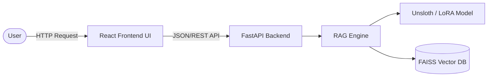
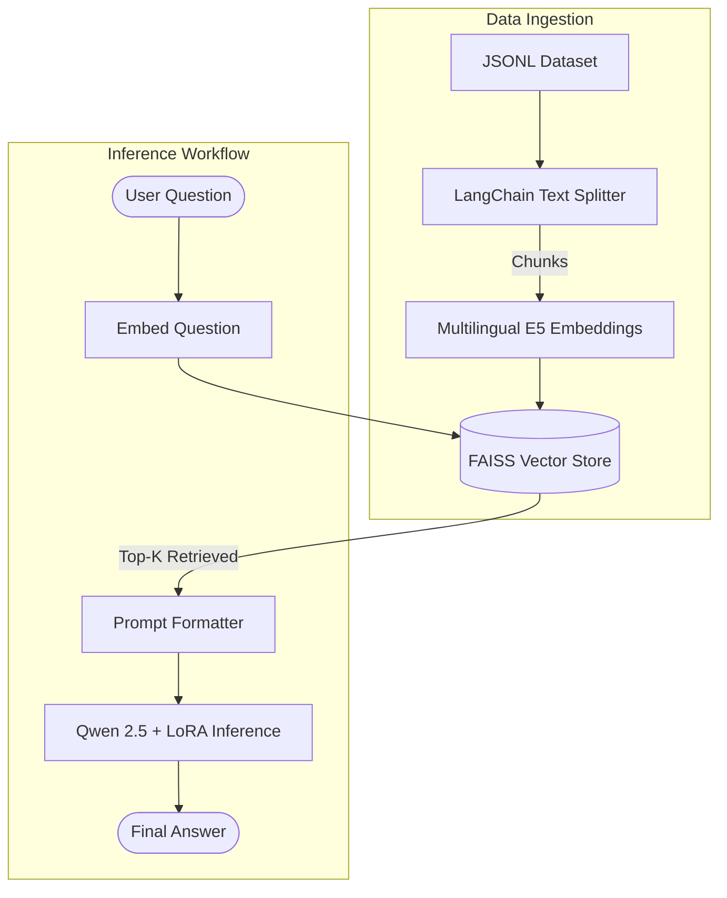

# 🏛️ AtlasLegalAI - Moroccan Legal Assistant

AtlasLegalAI is an advanced, robust Retrieval-Augmented Generation (RAG) system specialized in Moroccan law. By integrating a fine-tuned Qwen 2.5 foundation model (via Unsloth) and FAISS-based vector retrieval, AtlasLegalAI aims to provide highly accurate, legally-focused answers relying exclusively on validated Moroccan legal texts.

---

## 🌟 Key Features
- **Moroccan Legal Expertise:** Responses are strictly constrained to Moroccan legal knowledge context.
- **Efficient Local LLM:** Fast 4-bit inference optimized using Unsloth, running a `Qwen2.5-3B-Instruct` model fine-tuned via LoRA.
- **Multilingual RAG Pipeline:** Supports contextual grounding in French and Arabic, utilizing Semantic Vector Search via `FAISS` and multilingual E5 embeddings.
- **Modern Web Interface:** A sleek and responsive React application powered by Vite and Tailwind CSS.
- **Scalable Backend:** Standardized API endpoints built with FastAPI.

---

## 📐 Architecture & Pipeline

### System Architecture
The application follows a client-server architecture, enabling seamless integration between the modern React frontend and the powerful AI backend.



### RAG Data Pipeline
AtlasLegalAI strictly controls context retrieved to ensure the LLM generates accurate and non-hallucinated Moroccan legal insights.



---

## 🛠️ Tech Stack
- **Backend:** Python 3.10+, FastAPI, Unsloth, Transformers, LangChain, FAISS, PyTorch
- **Frontend:** Node.js, React 19, Vite, Tailwind CSS 4
- **Models:**
  - Base LLM: `unsloth/Qwen2.5-3B-Instruct-bnb-4bit`
  - Embeddings: `intfloat/multilingual-e5-large`

---

## 📋 Prerequisites
- **Python 3.10+**
- **Node.js 18+** (for the frontend)
- **NVIDIA GPU** with CUDA drivers (required for `unsloth` and 4-bit model inference)

---

## 🚀 Setup Instructions

### 1. Backend Setup
The backend contains the inference engine and the FastAPI server.

```bash
# 1. Navigate to the backend directory
cd backend

# 2. Create and activate a Python virtual environment
python3 -m venv venv
source venv/bin/activate  # On Windows: venv\Scripts\activate

# 3. Install Python dependencies
pip install -r requirements.txt

# 4. Prepare Models
# Note: Ensure that the fine-tuned LoRA weights are placed into `backend/models/lora/`.
```

### 2. Frontend Setup
The frontend hosts the ChatBot UI.

```bash
# 1. Navigate to the frontend directory
cd frontend

# 2. Install NPM packages
npm install
```

---

## ⚙️ How to Run

### Step 1: Start the Backend API
Run the FastAPI application from within the active virtual environment:
```bash
cd backend
source venv/bin/activate
python main.py
```
> The API will be available at `http://0.0.0.0:8000`. Wait for the console log indicating `Model Ready!` before sending requests.

### Step 2: Start the Frontend App
In a new terminal window, spin up the development server:
```bash
cd frontend
npm run dev
```
> Access the graphical interface via the local host link provided by Vite (e.g., `http://localhost:5173`).

---

## 📚 Managing Data

### Initial Knowledge Base
The primary dataset used by the FAISS vector database is located at:
`data/final_frensh_arabic_training_dataset.jsonl`

During the first pipeline initialization, the application will vectorize the `.jsonl` items using the sentence-transformers model and configure the retrieval store automatically. To add raw PDFs, place them in the `data/pdfs/` directory (ensure you run your PDF ingestion scripts if custom preprocessing is required).

---
*Disclaimer: AtlasLegalAI provides AI-generated responses based on retrieved legal documents. It is designed to assist with navigating legal contexts but does not replace professional legal counsel.*
